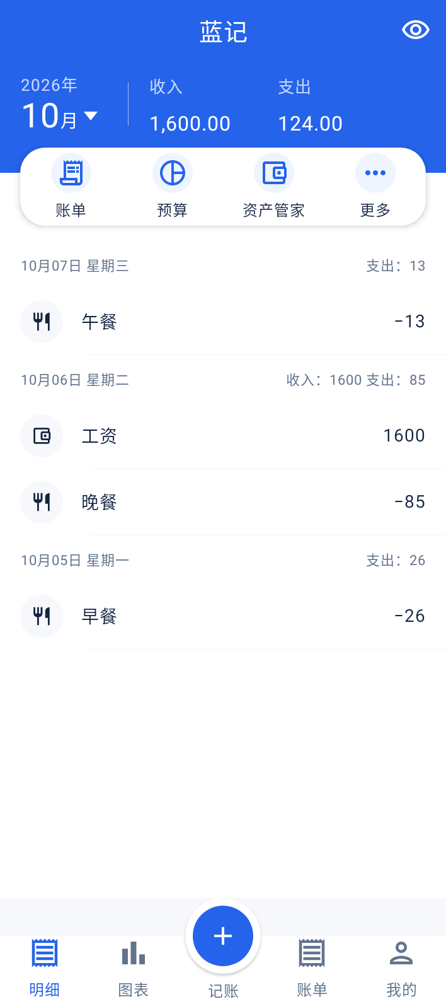
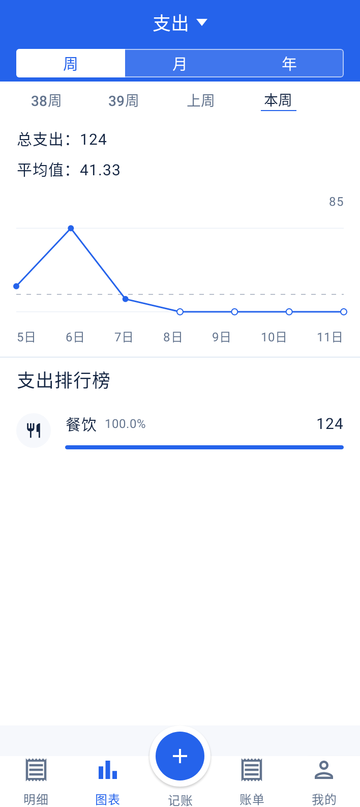
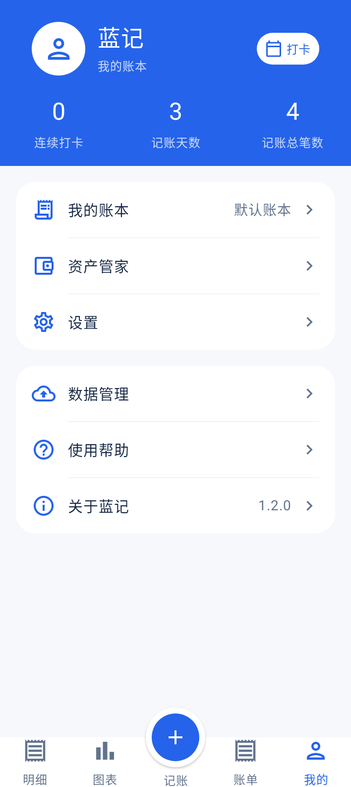
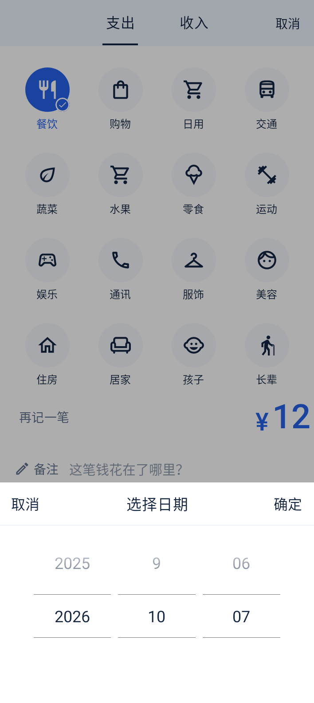
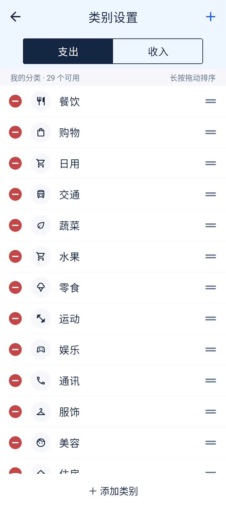
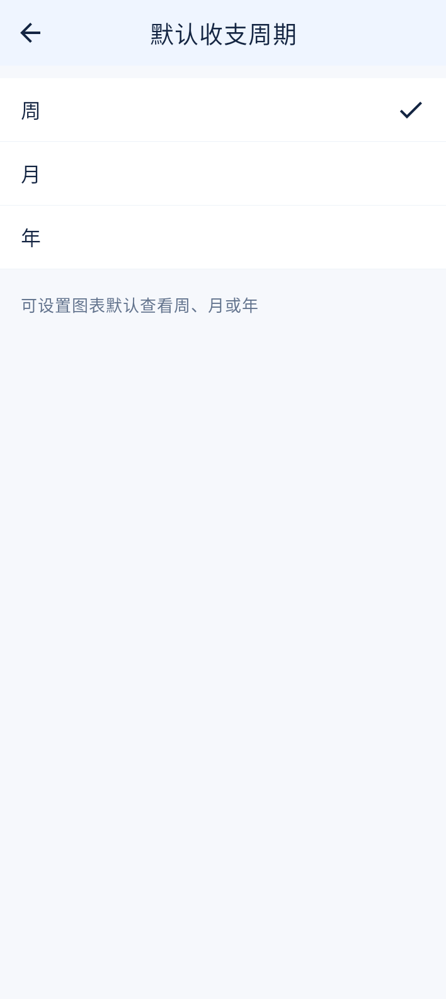

# 蓝记 BlueLedger

一个使用 Kotlin、Jetpack Compose 和 Room 实现的离线 Android 记账应用。蓝色主题，账本保存在本机，无广告、无会员功能。

**源码版本：1.2.0 · 最新发布 APK：1.1.3 · Android 8.0（API 26）及以上 · Apache-2.0**

[下载 APK](https://github.com/xiegaoxiao/BlueLedger/releases/latest) · [构建说明](docs/开源构建说明.md) · [代码结构](docs/架构说明.md) · [许可证](LICENSE)

## 功能

- 收入与支出记账，分类、备注、账户、日期滚轮及加减金额键盘。
- 按天查看明细，编辑账单、删除与撤销、隐藏金额。
- 周／月／年图表、分类占比、月／年账单和月报告图片分享。
- 月度预算、资产与负债管理、账户余额调整记录。
- 分类新增、编辑、归档及排序，长按手柄拖动，跨屏移动可使用上移／下移菜单。
- 完整 JSON 备份、校验与恢复、CSV 导出，保存目录选择一次后自动记住。
- 默认记账类型、图表周期、收支账户设置及本地记账提醒。
- 分类预算、标签、日历、自定义记账月起始日，以及删除账单的回收站。
- 按日／周／月／年自动记账，支持暂停规则和启动时补记；省电限制或强制停止可能延后后台执行。

应用没有网络权限。启用提醒时请求通知权限；导入导出使用 Android 系统文件访问框架，不申请存储权限。首次使用创建默认分类和账户，账本从空记录开始。

本地高级功能入口为「我的 → 设置 → 高级功能」。当前备份格式为 schema 3，支持导入 schema 1、2；恢复仍会替换现有账本，先校验和预览，再确认。周期规则的开始日期在过去时会补记，保存前请核对日期和金额。

## 界面预览

以下图片由 Robolectric 使用虚构账本生成，展示 1.2.0 的首页、周图表和我的页面。主要界面使用统一的品牌蓝、卡片边距与图标尺寸；周图表完整显示七天刻度，切换历史周时保持绘图区位置。

<p>
  
  
  
</p>

日期滚轮、分类设置和默认周期选择页：

<p>
  
  
  
</p>

## 开发

安装 JDK 21 与 Android SDK Platform 37，使用项目自带的 Gradle Wrapper：

```bash
./gradlew :app:assembleDebug
./gradlew :app:testDebugUnitTest
./gradlew :app:lintRelease :app:assembleRelease
```

Windows 使用 `gradlew.bat`。Release 构建启用代码和资源压缩，源码没有内置签名密钥；自行发布需要自己的签名配置。详细环境、输出路径和离线构建方法见[构建说明](docs/开源构建说明.md)。

项目包含业务、Room、备份与 Compose UI 测试。1.2.0 当前源码的本地完整回归为 **56 类、660 项全部通过**；Release 构建和 Lint 通过（0 errors / 45 warnings / 1 hint）。测试包括真实 Room 迁移、旧备份兼容、高级功能、重复切页和小屏／两倍字体的记账键盘。自动构建模板在 [docs/ci/android.yml](docs/ci/android.yml)，当前尚未启用在线 CI。

## 参与贡献

欢迎提交 Issue 和 Pull Request。复现问题时说明应用版本、Android 版本及操作步骤；截图和备份请使用虚构账本，移除个人信息。涉及金额、数据库迁移、备份恢复或排序的修改，请附相应测试。

## 许可证与依赖

项目源码采用 [Apache License 2.0](LICENSE)。版权与第三方说明见 [NOTICE](NOTICE) 和 [THIRD_PARTY_NOTICES.md](THIRD_PARTY_NOTICES.md)。

界面参考了常见记账应用的布局和交互，并使用自己的蓝色主题与 Material 图标。本项目与鲨鱼记账无关联，仓库不包含其应用源码、品牌素材、手机截图或个人账本。
